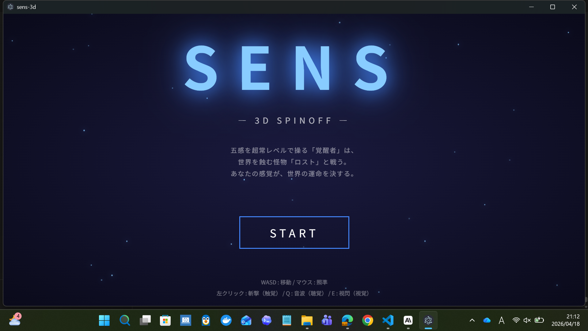

# SENS - 3D Spinoff

> 五感を超常レベルで操る「覚醒者」が、世界を蝕む怪物「ロスト」と戦う 3Dアクションゲーム



## 概要

2DバトルRPG『SENS』のスピンオフとして制作した 3Dアクションゲーム。
現代日本を舞台に、覚醒者となってロストを殲滅するミッションに挑む。

本作は **React + TypeScript + Three.js** で構築し、**Electron** でデスクトップアプリ化している。

## 特徴

- **五感に対応した3種類の能力** — 触覚（斬撃）・聴覚（音波）・視覚（視閃）をコマンドで使い分ける戦闘
- **WebGLによる3D描画** — Three.js でライティング・シャドウ・フォグを実装
- **AI追跡する敵とボス戦** — 複数のロストが連携して覚醒者を追う
- **タイトル → プレイ → リザルト** の完結したゲームループ

## 操作方法

| 操作 | アクション |
|---|---|
| `WASD` | 移動 |
| マウス移動 | 照準（マウスが指す方向を向く） |
| 左クリック | 斬撃（触覚）- 前方短距離・連射可 |
| `Q` | 音波（聴覚）- 自分を中心に円形の衝撃波 |
| `E` | 視閃（視覚）- 前方直線の長距離ビーム |

## 技術スタック

- **React 19** + **TypeScript**
- **Three.js** — 3D描画エンジン
- **Vite** — 開発・ビルドツール
- **Electron** — デスクトップアプリ化
- **electron-builder** — 実行ファイル生成

## 実行方法

### ビルド済み版を実行する（推奨）

1. `release/win-unpacked/SENS-3D.exe` をダブルクリック
2. Windows Defender の警告が出た場合は「詳細情報」→「実行」を選択

### 開発環境で実行する

```bash
# 依存パッケージのインストール
npm install

# ブラウザで開発版を起動
npm run dev

# Electron で開発版を起動
npm run electron:dev

# 実行ファイル(exe) をビルド
npm run electron:build
```

ビルド成果物は `release/win-unpacked/SENS-3D.exe` に生成される。

## プロジェクト構成

```
sens-3d/
├── electron/
│   └── main.cjs          # Electron エントリーポイント
├── src/
│   ├── App.tsx           # ゲーム本体（タイトル/プレイ/リザルト）
│   ├── main.tsx          # React エントリーポイント
│   └── index.css         # グローバルスタイル
├── package.json
└── vite.config.ts
```

## 実装のポイント

### 五感 × 攻撃システムの設計

原作の「覚醒者が五感を操る」という設定を、**3種類の攻撃が明確に使い分けられるゲームデザイン**に落とし込んだ。

- **触覚（斬撃）** → 近接・高頻度・低ダメージ
- **聴覚（音波）** → 範囲・自分中心・中ダメージ
- **視覚（視閃）** → 遠距離・直線・高ダメージ

それぞれクールダウンとヒット範囲が異なり、状況に応じた立ち回りが求められる。

### 敵AIの実装

- プレイヤーへのベクトル計算で常時追跡
- 敵同士の反発処理で団子状態を回避
- ボスは HP・ダメージ・サイズを通常敵と差別化

### Three.js と React の統合

`useEffect` 内で Three.js のシーンを初期化し、React の state とは独立した game loop を `requestAnimationFrame` で駆動。
HP・敵数・スキル名などの UI 情報だけを React の state に同期させ、**描画パフォーマンスと UI の宣言的記述を両立**させている。

## 制作背景

本作は、コロプラ様の選考課題として**1週間以内で制作**した作品です。

2DバトルRPG版『SENS』で構築した世界観を、3D空間でのアクションとして再解釈することを目指しました。
限られた期間の中で、タイトル画面からリザルト画面までの一通りのゲームループを完成させることを最優先としつつ、
『SENS』の「五感を操る」という設定を能力システムに反映させ、世界観の一貫性を保つことを意識しています。

## 作者

**岩浪 陽大 (Haruto Iwanami)**
東京立川情報ITクリエイター専門学校 AIシステム・データサイエンスコース

- paiza Python Sランク取得
- paiza 公式大会 1300人中 26位
- PR TIMES ハッカソン チーム最優秀賞